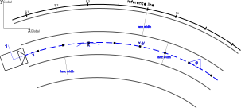

# Model capabilities, behavior and features

## Capability description

- [x] 1. Holding the vehicle in standstill by using the _brake pedal_
- [x] 2. Controlling an _desired acceleration_ by using _drive_ and _brake pedal_
- [x] 3. Controlling a _desired speed_
- [x] 4. Controlling predictively a _desired speed_ in a given _distance_
- [x] 5. Controlling the vehicle to stop within a _desired distance_
- [x] 6. Controlling a _desired distance_ to a preceding vehicle
- [x] 7. Controlling a _desired curvature_ by using the _steering_
- [x] 8. Following _reference points_ 
- [x] 9. Following _desired track points_ (horizon)
- [x] 10. Controlling a _desired lateral offset_ to a given track
- [x] 11. Switching from the current path to _another_ smoothly
- [x] 12. Following other _road participants_ in the traffic flow
- [x] 13. Keeping a maximum comfortable speed in curves (depending on the _maximum lateral acceleration_)
- [x] 14. Keeping a maximum allowed speed (defined by _speed rules_, e.g. speed limits)
- [x] 15. Keeping a _maximum comfortable speed_ defined by a parameter
- [x] 16. Adapting the speed predictively according to the local speeds (12., 13., 14.)
- [o] 17. Making _decision_ and _performing_ a lane change
- [x] 18. Making _decision_ to stop at stop signs
- [ ] 19. Making _decision_ to slow down or stop due to a conflict ahead

### Capability feature 1: Holding the Vehicle in Standstill

The implementation can be found in `AgentModel::subconsciousStartStop() -> double`. The function returns the target pedal value. A P-controller sets the vehicle pedal value accordingly.

**Objective:** 

Hold the vehicle in standstill (v = 0) such that the vehicle does not move.

**Initial situation:** 

The agent slows down (feature #4 or feature #5) to come to a stop. When a minimum velocity is reached, the agent activates this feature.

Relevant initial states are, if  
1. the vehicle has already stopped (v = 0),
2. the vehicle is still moving (v > 0).

**Execution:** 

By setting the flags `state.conscious.stop.standing` or `state.conscious.follow.standing` the feature is activated. When activated, the pedal value is set to `param.stop.pedalDuringStanding` (see [Parameters](#parameters)), otherwise the pedal value is set to infinity (direct pedal control deactivated).

**Behavior:**

1. The vehicle is kept in standstill if $v=0$ (Test 1.1)
2. From a velocity v < 10 m/s, the vehicle stops and reaches the target pedal value within 5 seconds within 7 seconds. The deceleration is slightly below -2 m/s2 (Test 1.2).

**Output:**

The output of the controller is the input pedal value for the vehicle model.

### Capability feature 2: Controlling a desired acceleration

The implementation can be found in `AgentModel::step(double simulationTime)`. The function calculates the desired acceleration. A PI-controller calculates the corresponding pedal value. 

**Objective:**

Accelerate the vehicle exactly with a desired acceleration.

**Limitations:** 

The acceleration is limited by the dynamics of the vehicle model. Basically, the max. acceleration is a function of the maximum power, the mass and the actual velocity of the vehicle. The maximum deceleration is basically limited by the maximum brake torque.

**Initial situation** 

The agent uses controlled acceleration when 
   * the agents wants to reach the desired speed (feature #3), or 
   * the agent approaches and keeps distance to a preceding road participant (feature #6), or 
   * the agent is going to stop the vehicle (feature #5). 

**Execution:** 

By setting the signal `state.subconscious.a`, the PI pedal controller sets a pedal value and compensates errors between desired and actual acceleration by a change in the drive or brake pedal.

Within the normal behavior, A sum of reaction values for velocity control, stop control and distance control during following are calculated to the resultant desired acceleration, based on the Intelligent Driver Model (IDM) [1]. 

**Behavior:**

The agent model compensates large acceleration errors within 5 seconds to an error below 0.01 m/s2. This expression is valid for realistic accelerations within the limitations of the vehicle model. The behavior can be adapted by the PI pedal controller. A large I parameter value leads to quick and accurate control of the acceleration with an overshoot, when steps are compensated. A low I parameter value leads to no overshoot, but a very low error is reached within a larger time period.

**Output:**

The output of the controller is the input pedal value for the vehicle model.

### Capability feature 3: Controlling a desired speed

The implementation can be found in `AgentModel::step(double simulationTime)`. The function calculates the desired acceleration.

Feature chain: Desired velocity &rarr; desired acceleration (feature 2) &rarr; pedal value (pedal controller) &rarr; actual pedal position (VM) &rarr; actual acceleration (VM) &rarr; actual velocity.

**Objective:**

Accelerate or decelerate the vehicle to reach and hold a desired velocity.

**Limitations**

The velocity of teh vehicle is limited by the dynamics of the vehicle model. Basically, the max. velocity is a function of the maximum power of the vehicle (and resistance parameters). The minimum velocity is zero. Backwards driving is not implemented, yet.

**Initial situation** 

The agent uses the velocity control continuously 
   * to limit the desired curve speed (feature #12), and 
   * to avoid exceeding the permitted maximum speed (feature #13), and 
   * to avoid exceeding the max. comfortable cruise speed (feature #14). 
   
**Execution:** 
   
By setting the signals `state.conscious.velocity.comfort`, `state.conscious.velocity.curve`, `state.conscious.velocity.rule`, the agent model calculates a desired acceleration.
   
The minimum of the stated velocities is calculated and set as local maximum velocity. Based on the IDM [1], the acceleration is calculated.  
   
**Behavior:**

The agent model accelerates or decelerates to reach the desired velocity from the actual velocity (velocity step). With decreasing the step, the actual acceleration decreases as well until, when the desired velocity is reached, the acceleration is zero. The time interval in which the velocity is reached, strongly depends on the velocity step and the acceleration parameter `_param.velocity.a`. The parameter defines the maximum acceleration to compensate velocity steps. Starting from v = 0, the agent model accelerates with the maximum acceleration set by the parameter.

With a maximum acceleration set to 2.0 m/s2, the agent model reaches a velocity of 100 kph (27.8 m/s) within 30 seconds with an remaining error of less than 0.1 m/s (~99.8 %). Another performance factor for this feature is, that each velocity between 0 and 30 m/s is reached by at least 0.2 m/s within the time interval equal to the step (T_0.2 = (v_desired - v_actual))

**Output:**

## Parameters
TODO

### Input-Interface
The inputs required by the driver model are divided into five sub-structures:
* **vehicle:** represents the vehicle state
* **horizon:** a corridor in which the driver model plans its behavior
* **signals:** array of relevant signals along the route
* **lanes:** array of surrounding lanes relative to the driver's lane
* **targets:** array of all moving objects around the driver

Each quantity is documented in Doxygen style within `AgentModelInterface.h`. 
However, in the following some remarks on important structures are described in more detail.

#### Horizon
The most sensitive interface is the horizon because the driver model uses it to plan its longitudinal and lateral movement. 
First, the entries of a single horizon knot are described followed by instructions on how the horizon knots shall be arranged around the driver model.

##### Knots
Every knot is located in the lane center of the current ego lane. 
At each knot the $x,y$-coordinates relative to the ego coordinate system have to specified. 
Further, the distance $ds$ along $s$ needs to be specified. 
Here, often it is sufficient to take the distances along the reference line (if the horizon is generated from an OpenDRIVE map). 
Note: in very narrow curves this simplification might not be adequate. 
The same assumptions are valid for the curvature $\kappa$ at each horizon knot.
Positive curvature values correspond to left turns in positive $s$-direction.
The angle $\psi$ is defined as the road's heading relative to ego-coordinate x-axis.
Last, the lane width of the ego lane and its left and right neighbor has to be specified at each horizon knot.

In Fig. 1 an example for each entry of one horizon knot is illustrated. 

*Fig 1: Horizon sketch*

##### Horizon Arrangement
The position and amount of horizon knot along $s$ are theoretically arbitrary.
However, we provide some recommended rules to generate the horizon in order to achieve the best possible driver model behavior.

1. The number of horizon knots `NOH` is currently $32$. This has been found as a good tradeoff in terms of efficiency and accuracy
2. The maximum horizon distance is not constant but dependent on the current speed. Here, $ds_\text{max} = 20 \text{sec} * v_x$ has been proved to be good.
3. It is advised to place the first horizon a little behind the ego vehicle because of some interpolations inside the driver model. A good value is $ds_0=-1\text{sec}*v_x$
4. The knot distribution along $s$ between the first and last horizon knot can be chosen arbitrarily. However, linear or quadratic increasing distance both leads to good behavior.
5. If horizon knots are behind the end of a road, set $ds=\infty$. The driver model then will ignore the respective knots

#### Lanes
Up to `NOL` lanes can be send to the driver model. 
`NOL` is currently $32$ but often fewer lanes are sufficient.
Some remarks on the lane id: 
* The `id` is not just an identifier but also indicates the position relative to the ego lane. Examples: `id=`
  * $0$ : ego lane
  * $-1$ : next lane to the left relative to the ego vehicle
  * $1$ : next lane to the right relative to the ego vehicle
  * $127$ : indicates that there is no lane entry (because the interface is of static length)
* Lanes do not need to sorted by their id

All other entries are described in `src/AgentModelInterface.h` under `struct Lane {...}`.

#### Targets
The required quantities for surrounding targets is documented straightforward in `src/AgentModelInterface.h` under `struct Target {...}`.

#### Signals
Signals may be 
* Stop signs (`SIGNAL_STOP`)
* Traffic lights (`SIGNAL_TLS`)
* Speed limits (`SIGNAL_SPEED_LIMIT`)

Additionally to its type, a signal must be equipped with a unique id, the distance along $s$ to the signal and a value. 
The value is irrelevant for stop signs. Speed limits are given in `m/s`. 
A concept for traffic lights will follow in a later development stage.

### Output-Interface
There is no distinct output interface.
However, the final state of the driver (behavior) model is the desired acceleration $a_\text{des}$ and the desired curvature $\dot{\kappa}_\text{des}$. 
These quantities are located in the structure `State` inside the `subconcious` attribute of `src/AgentModelInterface.h`.

Alternatively, if a vehicle model shall be used that takes pedal and steering values as an input, a simple controller could be deployed that controls the desired subconscious longitudinal and lateral quantities.

### Injection Concept
T.B.D.

## References
[1] Treiber, Martin, Ansgar Hennecke, and Dirk Helbing. “Congested Traffic States in Empirical Observations and Microscopic Simulations.” Physical Review E 62.2 (2000): 1805–1824.

## TODOs:
* List all parameters 
* References
* Test: following down to low speeds (v ~= 0)
